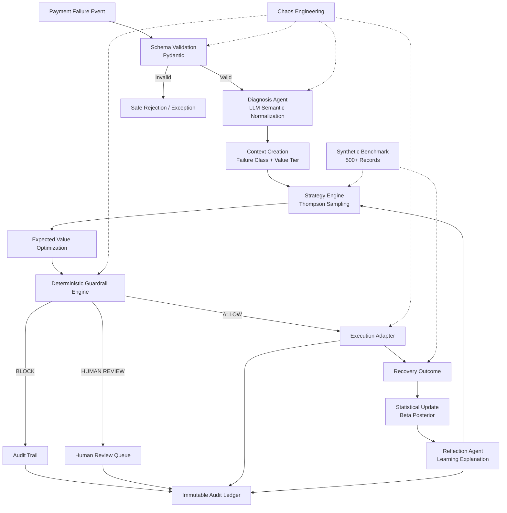
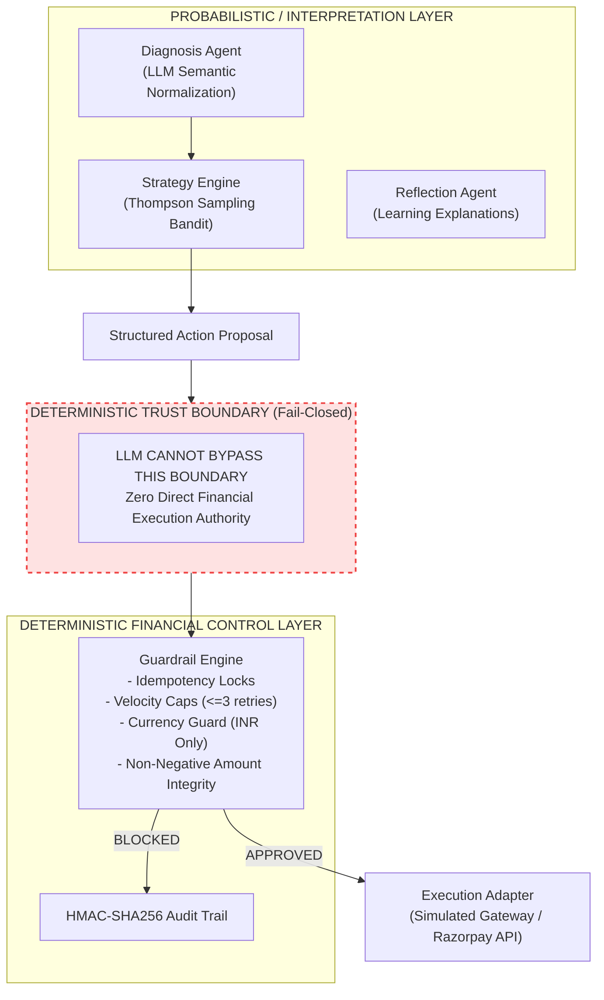

# RevPilot

**Autonomous AI Revenue Recovery Controller for Payment Failures**

> *"LLMs interpret and explain. Statistical models optimize. Deterministic code controls financial authorization. No LLM may directly authorize, modify, or execute a financial action."*

[](https://github.com/Rishabh-377/RevPilot/actions)
[](https://www.python.org/downloads/)
[](https://fastapi.tiangolo.com)
[](LICENSE)

---

## What is RevPilot?

RevPilot is an autonomous revenue recovery controller that intercepts, diagnoses, and recovers failed payment transactions in real time. It uses a tripartite architecture that combines LLM-based semantic error classification, contextual Thompson Sampling bandit optimization, and deterministic fail-closed financial guardrails.

---

## Problem

In digital commerce and fintech payment ecosystems (such as UPI, Cards, and NetBanking):
1. **Dumb Retries Cause Financial Loss**: Naive automated retry engines blindly hammer payment gateways, resulting in merchant chargebacks, customer UX degradation, rate-limiting penalties, and duplicate debit liabilities.
2. **Gateway Error Chaos**: Error strings returned by payment aggregators and banking switches are unstructured, cryptic, and inconsistent across acquirers (e.g., `U30`, `502 Bad Gateway`, `ISO-05`, `Do not honour`).
3. **Unsafe LLM Hallucinations**: Directly delegating financial execution or retry scheduling to autonomous LLM agents introduces severe risks of prompt injection, non-deterministic execution, amount hallucination, and financial leakage.

---

## Core Innovation

RevPilot implements a **Tripartite Separation of Concerns**:
- **Interpretation (AI Layer)**: Semantic classification of unstructured gateway errors into standard taxonomy categories without financial execution authority.
- **Optimization (Statistical Layer)**: Segmented Thompson Sampling maintaining $\text{Beta}(\alpha, \beta)$ distributions across 27 context states to maximize Expected Value (EV) net of API fees and customer friction costs.
- **Authorization (Deterministic Guardrail Layer)**: Strict Python code enforcing atomic idempotency locks, velocity caps, currency checks, and positive amount validation before any gateway call is dispatched.

---

## Architecture



For complete architectural details, see [docs/architecture.md](docs/architecture.md).

---

## Agent Responsibilities & Trust Boundaries



1. **Diagnosis Agent**: Normalizes raw gateway strings into standard failure classes. Gated behind a 5.0-second timeout with deterministic regex fallback.
2. **Strategy Engine**: Selects candidate recovery actions by sampling Beta posteriors and computing Expected Value.
3. **Guardrail Engine**: The sole gatekeeper. Evaluates deterministic safety rules and permits or blocks execution.
4. **Execution Adapter**: Dispatches authorized recovery actions to the payment gateway.
5. **Reflection Agent**: Explains posterior changes, tracks policy shifts, and summarizes learning dynamics without financial mutation rights.

---

## Decision Engine

RevPilot discretizes payment failure events into **27 learning context states**:
$$\text{Context} = \text{Failure Class (9)} \times \text{Value Tier (3)}$$

### Taxonomy Classes:
- `TIMEOUT_TRANSIENT`: Network drops, upstream read/connect timeouts.
- `HARD_FUNDS_ISSUE`: Insufficient balance, card limit exhausted.
- `ISSUER_DECLINE`: Bank policy decline, card restricted.
- `AUTH_BLOCKED`: 3DS authentication failure, OTP timeout.
- `INFRA_OUTAGE`: Gateway downtime, NPCI switch unavailable.
- `DUPLICATE`: Idempotency conflicts, duplicate reference ID.
- `CUSTOMER_ABANDONMENT`: Modal closed, UPI collect request expired.
- `FRAUD_SUSPECTED`: Velocity triggers, card-testing patterns.
- `UNKNOWN`: Unrecognized or corrupted telemetry.

### Expected Value (EV) Formulation:
$$\text{EV}(a) = P_{\text{sampled}}(a) \times \text{Amount} - C_{\text{API}}(a) - C_{\text{friction}}(a)$$

Candidate action arms: `IMMEDIATE_RETRY`, `DELAYED_RETRY`, `PAYMENT_LINK`, `SWITCH_METHOD`, `HUMAN_ESCALATION`.

---

## Financial Guardrails

Every proposed recovery decision must pass all deterministic rules:
- **Idempotency Guard**: Rejects replayed payment IDs via atomic lock storage.
- **Velocity Guard**: Enforces maximum of 3 retries per payment event.
- **Currency Guard**: Restricts operations to valid merchant currency (`INR`).
- **Amount Integrity Guard**: Rejects $\le 0$ or mutated amounts.
- **Fraud Interception**: Immediate abandonment of high-risk transactions.
- **Non-Retryable Check**: Prevents automated execution on non-retryable failure classes.

---

## Chaos Engineering

RevPilot includes an automated 10-scenario Chaos Engineering suite (`POST /api/v1/dashboard/chaos/run`):
- `CHAOS_01_DUPLICATE_TXN`: Duplicate replay attack $\implies$ Blocked by idempotency lock.
- `CHAOS_02_CORRUPTED_HEX`: Unparseable hex payload $\implies$ Isolated as `UNKNOWN`, safe fallback.
- `CHAOS_03_NEGATIVE_AMOUNT`: Negative amount payload $\implies$ Ingress schema validation rejection.
- `CHAOS_04_MALFORMED_JSON`: Non-numeric string payload $\implies$ Pydantic schema validation rejection.
- `CHAOS_05_UNSUPPORTED_CURRENCY`: Foreign currency injection (`BTC`) $\implies$ Currency guard rejection.
- `CHAOS_06_VELOCITY_SPIKE`: Rapid burst sequence $\implies$ Velocity rate limiter containment.
- `CHAOS_07_OUT_OF_ORDER_RETRIES`: Attempt count $> 3$ $\implies$ Velocity threshold rejection.
- `CHAOS_08_API_TIMEOUT`: Network timeout simulation $\implies$ Caught safely; zero false revenue recorded.
- `CHAOS_09_EXECUTION_FAILURE`: Bank decline simulation $\implies$ Accurately recorded in posterior state.
- `CHAOS_10_LLM_ADVERSARIAL_INJECTION`: Prompt injection in error string $\implies$ Constrained by schema; zero execution.

---

## Benchmark

Evaluated on a frozen 500-record synthetic simulation dataset generated with fixed seed `20260821`:

| Metric | Static Baseline | RevPilot Adaptive | Status / Delta |
| :--- | :--- | :--- | :--- |
| **Total Events Processed** | 500 | 500 | Equal (Seed `20260821`) |
| **Diagnosis Accuracy** | 89.60% | 89.60% | Equal |
| **Recovery Rate** | 56.20% | 30.40% | Guardrail-Constrained |
| **Gross Recovered Revenue** | ₹35,96,572.30 | ₹15,52,825.49 | Synthetic simulation |
| **Action Cost Incurred** | ₹2,588.00 | ₹1,142.50 | Saved: ₹1,445.50 |
| **Friction Cost Incurred** | ₹1,184.00 | ₹796.00 | Saved: ₹388.00 |
| **Net Recovered Revenue** | ₹35,92,800.30 | ₹15,50,886.99 | Reconciled net of costs |
| **Unsafe Executions** | **24** | **0** | **100% Safe (0 Unsafe Executions)** |
| **Decisions Blocked by Guardrails**| 0 | 133 | Deterministic Fail-Closed Safety |
| **Escalated for Human Review** | 0 | 46 | Ambiguous / High-Value Isolation |

*Note: Results are measured on a synthetic simulation benchmark.*

---

## Tech Stack

- **Backend**: Python 3.12+, FastAPI, Pydantic v2, Uvicorn
- **AI & NLP**: Google Gemini 2.5 Flash (`google-genai`), Regex Fallback Classifier
- **Bandit & Mathematics**: NumPy, SciPy (Beta Posterior Sampling)
- **Frontend**: Vanilla JS (ES6+), HTML5, TailwindCSS (Self-contained SPA)
- **Testing & Verification**: Pytest, Pytest-Asyncio, HTTPX

---

## Running Locally

### 1. Clone & Install
```bash
git clone https://github.com/Rishabh-377/RevPilot.git
cd RevPilot

python3 -m venv .venv
source .venv/bin/activate
pip install -r requirements.txt
cp .env.example .env
```

### 2. Start Development Server
```bash
# Using persistent lifecycle script:
./scripts/start_dev.sh

# Or directly with uvicorn:
uvicorn backend.main:app --host 127.0.0.1 --port 8000 --reload
```

- **Interactive Dashboard**: [http://localhost:8000/dashboard](http://localhost:8000/dashboard)
- **Swagger API Docs**: [http://localhost:8000/docs](http://localhost:8000/docs)
- **Health Check**: [http://localhost:8000/api/v1/health](http://localhost:8000/api/v1/health)

### 3. Server Management Scripts
```bash
./scripts/status_dev.sh   # Inspect PID, port, and health response
./scripts/stop_dev.sh     # Safely terminate dev server
```

---

## Project Structure

```text
revpilot/
├── .agents/                 # Antigravity sidecar and agent configs
├── backend/
│   ├── agents/              # Diagnosis & Reflection LLM agents
│   ├── api/                 # FastAPI routes and endpoints
│   ├── bandit/              # Contextual Thompson Sampling state & logic
│   ├── models/              # Pydantic schemas and taxonomy enums
│   ├── services/            # Guardrails, Execution, Audit, and Chaos services
│   ├── config.py            # Environment settings
│   └── main.py              # FastAPI application entrypoint
├── docs/
│   └── architecture.md      # Comprehensive architecture & trust models
├── frontend/
│   ├── favicon.ico          # Application favicon
│   ├── favicon.svg          # Application vector branding
│   └── index.html           # Single-page dashboard UI
├── output/                  # Benchmark metrics, comparison, & audit log files
├── scripts/
│   ├── run_benchmark.py     # Reproducible 500-event benchmark runner
│   ├── run_chaos_suite.py   # Adversarial 10-scenario chaos suite runner
│   ├── start_dev.sh         # Persistent server start script
│   ├── status_dev.sh        # Server status checker
│   └── stop_dev.sh          # Server termination script
└── tests/                   # 320+ unit and integration test suite
```

---

## Testing

Run the full automated test suite:
```bash
pytest -v
```

---

## Limitations

1. **Synthetic Simulation**: Default benchmark runs against a simulated gateway environment; production merchant deployment requires integration with live acquirer webhooks and payment gateways.
2. **Prior Cold-Start**: Unseen failure classes initialize with uninformative priors $\text{Beta}(1.0, 1.0)$, requiring exploration cycles to reach optimal policy convergence.
3. **Fail-Closed Tradeoff**: Strict guardrails sacrifice aggressive recovery volume in favor of zero unsafe financial executions.
