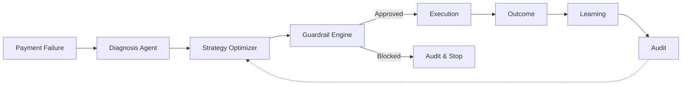

# RevPilot

**Adaptive AI Revenue Recovery Controller for Failed Payments**

> Razorpay AI Buildathon 2026 — Track 4: AI Finance Controller

## Overview

RevPilot is an intelligent payment recovery system that uses Thompson Sampling and LLM-assisted diagnosis to maximize revenue recovery from failed payments, while maintaining deterministic financial safety through a guardrail engine.

### Core Recovery Loop



### Architectural Principle

| Layer | Role | Technology |
|-------|------|-----------|
| **Interpretation** | Semantic root-cause analysis | LLM (Gemini 2.5 Flash) with deterministic regex fallback |
| **Optimization** | Select best retry strategy | Thompson Sampling Bandit |
| **Authorization** | Approve/block financial actions | Deterministic code ONLY |

> ⚠️ **No LLM may directly authorize, modify, or execute a financial action.**

## Project Structure

```
revpilot/
├── backend/
│   ├── api/              # FastAPI routes
│   ├── agents/           # LLM-assisted diagnosis (Gemini 2.5 Flash) & reflection
│   ├── bandit/           # Thompson Sampling optimizer
│   ├── models/           # Pydantic contracts
│   ├── services/         # Guardrail, audit, execution
│   ├── simulator/        # Event generation, ground truth, benchmarking
│   ├── taxonomy/         # Failure classification
│   ├── config.py         # Application settings
│   └── main.py           # FastAPI entrypoint
├── data/                 # Data files
├── tests/                # pytest test suite
├── scripts/              # Utility scripts
├── docs/                 # Architecture & design docs
├── frontend/             # Dashboard single-page application
└── README.md
```

## Getting Started

### Prerequisites

- Python 3.12+
- pip

### Install

```bash
cd revpilot
python -m venv .venv
source .venv/bin/activate
pip install -r requirements.txt
```

### Configure Gemini (Optional for live LLM diagnosis)

```bash
export GEMINI_API_KEY="your-api-key-here"
export REVPILOT_LLM_ENABLED="true"
```
*Note: If no API key is provided or if LLM calls timeout/fail, RevPilot seamlessly degrades to its deterministic rule-based fallback classifier.*

### Run

```bash
uvicorn backend.main:app --reload
```

### Test

```bash
pytest -v
```

## Data Contracts

| Contract | Producer | Consumer | Purpose |
|----------|----------|----------|---------|
| `PaymentFailureEvent` | External / Simulator | Diagnosis Agent | Input failure event |
| `DiagnosisResult` | Diagnosis Agent | Bandit Optimizer | Root cause + retryability |
| `StrategyDecision` | Bandit Optimizer | Guardrail Engine | Selected retry strategy |
| `GuardrailDecision` | Guardrail Engine | Execution Service | Approve/block decision |
| `OutcomeResult` | Execution Service | Learning / Audit | Recovery result |
| `AuditEvent` | All components | Audit Service | Immutable log entry |
| `BenchmarkResult` | Simulator | Reporting | Performance metrics |
| `ExceptionRecord` | All components | Exception Handler | Graceful failure tracking |

## Tech Stack

| Component | Technology |
|-----------|-----------|
| Language | Python 3.12+ |
| API | FastAPI |
| Contracts | Pydantic v2 |
| Audit / Persistence | JSONL immutable audit log & JSON state store |
| Testing | pytest |
| Linting | ruff, mypy |
| LLM | Google Gemini 2.5 Flash REST client (httpx) + Pydantic validation |
| Fallback Classifier | Deterministic regex taxonomy rules |
| Optimization | Contextual Thompson Sampling Multi-Armed Bandit |


## Documentation

- [Architecture](docs/architecture.md)
- [Data Contracts](docs/data-contracts.md)
- [Failure Taxonomy](docs/failure-taxonomy.md)
- [Bandit Design](docs/bandit-design.md)
- [Guardrail Design](docs/guardrail-design.md)
- [Benchmark Methodology](docs/benchmark.md)
- [Chaos Testing](docs/chaos-design.md)

## License

TBD
