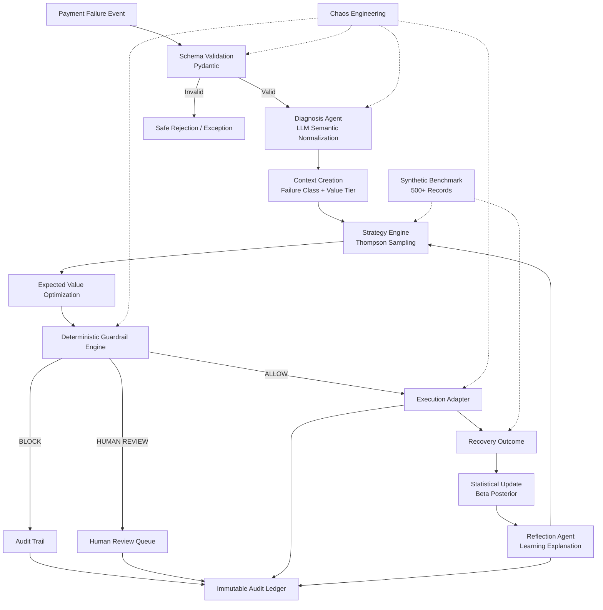
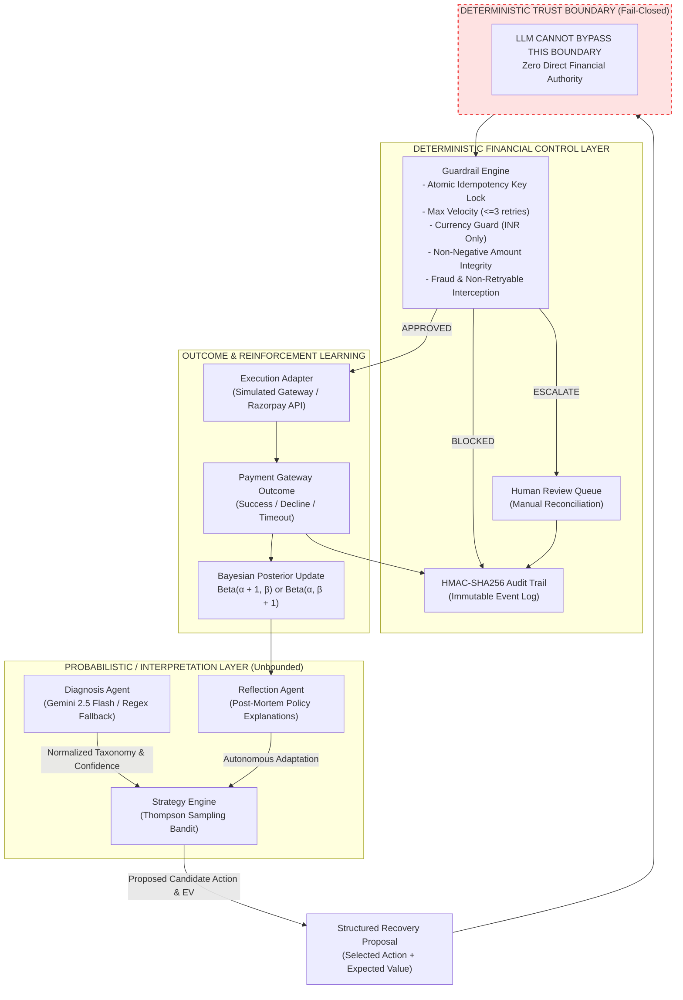

# RevPilot System Architecture & Trust Model

## 1. Architectural Principle

```text
"LLMs interpret and explain.
Statistical models optimize.
Deterministic code controls financial authorization.
No LLM may directly authorize, modify, or execute a financial action."
```

RevPilot is structured around strict separation of responsibilities:
1. **Probabilistic Interpretation (AI Layer)**: Semantic classification of unstructured gateway logs and qualitative explanations of Bayesian dynamics.
2. **Statistical Optimization (Decision Engine)**: Contextual Thompson Sampling over $\text{Beta}(\alpha, \beta)$ distributions to balance exploration and exploitation under Expected Value (EV) maximization.
3. **Deterministic Financial Control (Guardrail Layer)**: The sole gatekeeper authorized to permit financial executions, enforcing atomic idempotency, velocity caps, currency checks, and non-negative amount invariants.

---

## 2. End-to-End System Architecture



---

## 3. Trust Boundaries & Security Model



---

## 4. Component Responsibilities

| # | Component | Primary Responsibility | Failure Mode / Fallback |
|---|---|---|---|
| **1** | **Schema Validation** (`Pydantic`) | Validates ingress payment events, types, non-negative amounts, and currency schemas. | Rejects malformed JSON with `422 Unprocessable Entity` before pipeline ingress. |
| **2** | **Diagnosis Agent** (`LLM / Regex`) | Normalizes raw, unstructured gateway error strings into standard taxonomy classes (`TIMEOUT_TRANSIENT`, `HARD_FUNDS_ISSUE`, `ISSUER_DECLINE`, `AUTH_BLOCKED`, `INFRA_OUTAGE`, `DUPLICATE`, `CUSTOMER_ABANDONMENT`, `FRAUD_SUSPECTED`, `UNKNOWN`). | Falls back to deterministic regex pattern matchers on timeout ($>5.0\text{s}$) or parse failure. |
| **3** | **Context Creation** | Maps failure classification and transaction amount into one of 27 learning context cells (9 Failure Classes $\times$ 3 Value Tiers: `LOW` $\le ₹1\text{k}$, `MID` $₹1\text{k}–₹5\text{k}$, `HIGH` $>₹5\text{k}$). | Resolves to fallback context `UNKNOWN+MID` under incomplete telemetry. |
| **4** | **Strategy Engine** (`Thompson Sampling`) | Maintains discrete $\text{Beta}(\alpha, \beta)$ distributions per candidate action arm, samples expected recovery probabilities, and scores arms by Expected Value (EV). | Initialized with uninformative priors $\text{Beta}(1.0, 1.0)$; zero hardcoded ground-truth probabilities. |
| **5** | **Guardrail Engine** (`Deterministic Gatekeeper`) | Enforces fail-closed deterministic invariants: idempotency locking, maximum 3 retries per payment, INR currency constraint, positive amount validation, and fraud auto-blocking. | Rejects or escalates high-risk actions before execution dispatch. |
| **6** | **Execution Adapter** | Dispatches recovery payloads to the gateway execution engine (Simulated Gateway by default, or Razorpay Test API). | Isolated behind guardrail approval; never invoked for blocked decisions. |
| **7** | **Outcome Analysis** | Records recovery outcome, recovered revenue, direct gateway API costs, and customer friction penalty units. | Distinguishes actual gateway confirmation from transient transport drops. |
| **8** | **Statistical Update** | Updates $\text{Beta}(\alpha, \beta)$ parameters ($\alpha \leftarrow \alpha + 1$ on success, $\beta \leftarrow \beta + 1$ on failure) in an idempotent, atomic state store. | Duplicate event outcomes are ignored to prevent posterior skew. |
| **9** | **Reflection Agent** | Analyzes batch learning metrics, tracks posterior mean drifts ($\Delta\mu$), detects policy changes, and synthesizes explainable learning summaries. | Read-only commentary; zero mutation authority over financial state or active priors. |
| **10** | **Audit Trail** | Emits append-only HMAC-SHA256 structured JSONL audit logs capturing every decision stage. | Persisted to disk (`output/audit_log.jsonl`); immutable ledger. |

---

## 5. Concrete Decision Flow Example

Consider a failed transaction with amount **₹2,499.00**:

```text
1. INGRESS EVENT:
   - Payment ID:    pay_sample_101
   - Amount:        ₹2,499.00
   - Gateway Error: "Gateway timeout on read (upstream switch U30)"
   - Attempt Count: 0

2. DIAGNOSIS AGENT:
   - Normalized Class: TIMEOUT_TRANSIENT
   - Confidence:       0.94
   - Retryability:     true
   - Risk Level:       LOW

3. CONTEXT CREATION:
   - Context State:    TIMEOUT_TRANSIENT + MID_VALUE (₹1,000 – ₹5,000)

4. THOMPSON SAMPLING STRATEGY EVALUATION:
   - Arm 1: IMMEDIATE_RETRY   -> Sampled P = 0.82 | API Cost = ₹2.00 | Friction = 0.10 -> EV = (0.82 × ₹2,499) - ₹2.10 = ₹2,047.08 [WINNER]
   - Arm 2: DELAYED_RETRY     -> Sampled P = 0.65 | API Cost = ₹2.00 | Friction = 0.20 -> EV = (0.65 × ₹2,499) - ₹2.20 = ₹1,622.15
   - Arm 3: PAYMENT_LINK      -> Sampled P = 0.40 | API Cost = ₹5.00 | Friction = 0.50 -> EV = (0.40 × ₹2,499) - ₹5.50 = ₹994.10
   - Arm 4: SWITCH_METHOD     -> Sampled P = 0.35 | API Cost = ₹3.00 | Friction = 0.40 -> EV = (0.35 × ₹2,499) - ₹3.40 = ₹871.25
   - Arm 5: HUMAN_ESCALATION  -> Sampled P = 0.10 | API Cost = ₹50.00| Friction = 1.00 -> EV = (0.10 × ₹2,499) - ₹51.00 = ₹198.90

5. GUARDRAIL ENGINE:
   - Rule 1 (Idempotency Lock):       PASS (First attempt for pay_sample_101)
   - Rule 2 (Velocity Cap <= 3):      PASS (Attempt count = 0)
   - Rule 3 (Supported Currency):     PASS (Currency = INR)
   - Rule 4 (Amount Integrity > 0):   PASS (Amount = ₹2,499.00)
   - Rule 5 (Fraud Interception):     PASS (Risk = LOW)
   - VERDICT: APPROVED

6. EXECUTION ADAPTER:
   - Dispatched action IMMEDIATE_RETRY to Gateway Adapter.
   - Status: EXECUTED (execution_called = true)
   - Response: 200 OK (200_OK_RECOVERED)

7. OUTCOME & STATISTICAL UPDATE:
   - Status: SUCCESS
   - Gross Recovered: ₹2,499.00
   - Net Recovered:   ₹2,496.90
   - Posterior Update: TIMEOUT_TRANSIENT+MID [IMMEDIATE_RETRY] α += 1

8. AUDIT LOGGING:
   - Emitted 7 structured audit records with HMAC-SHA256 verification hash.
```

---

## 6. Adversarial Resilience (Chaos Engineering)

RevPilot includes an automated 10-scenario adversarial attack suite (`POST /api/v1/dashboard/chaos/run`) to verify guardrail containment under failure conditions:

1. **`CHAOS_01_DUPLICATE_TXN`**: Replays identical transaction payload $\implies$ Blocked by `rule_idempotency` (`execution_called = false`, ₹0.00 leakage).
2. **`CHAOS_02_CORRUPTED_HEX`**: Injects unparseable hex buffer $\implies$ Normalized to `UNKNOWN` (`confidence < 0.60`), isolated from unsafe automated retries.
3. **`CHAOS_03_NEGATIVE_AMOUNT`**: Submits `amount = -500.00` $\implies$ Rejected at schema validation ingress (`amount > 0` constraint).
4. **`CHAOS_04_MALFORMED_JSON`**: Submits non-numeric string payload $\implies$ Ingress schema validation error (`422 Unprocessable Entity`).
5. **`CHAOS_05_UNSUPPORTED_CURRENCY`**: Injects `currency = "BTC"` $\implies$ Blocked by `rule_supported_currency` (INR only).
6. **`CHAOS_06_VELOCITY_SPIKE`**: Rapid replay sequence $\implies$ Blocked by velocity rate limiters.
7. **`CHAOS_07_OUT_OF_ORDER_RETRIES`**: Submits attempt count = 4 $\implies$ Blocked by `rule_max_retries_per_payment` ($>3$ threshold).
8. **`CHAOS_08_API_TIMEOUT`**: Simulates downstream gateway connection timeout $\implies$ Handled gracefully via `NetworkTimeoutException` with zero false revenue recorded.
9. **`CHAOS_09_EXECUTION_FAILURE`**: Simulates bank rejection $\implies$ Recorded as decline; posterior $\beta$ incremented without false recovery claims.
10. **`CHAOS_10_LLM_ADVERSARIAL_INJECTION`**: Injects prompt jailbreak into gateway error string $\implies$ LLM output constrained to Pydantic enum schema; zero execution bypass.

---

## 7. Synthetic Simulation Benchmark

RevPilot is benchmarked against a static baseline policy on a frozen 500-event synthetic dataset generated with seed `20260821`:

| Metric | Static Baseline | RevPilot Adaptive | Evaluation Status / Delta |
| :--- | :--- | :--- | :--- |
| **Total Events Processed** | 500 | 500 | Equal (Frozen seed `20260821`) |
| **Diagnosis Accuracy** | 89.60% | 89.60% | Equal |
| **Recovery Rate** | 56.20% | 30.40% | Guardrail-Constrained |
| **Gross Recovered Revenue** | ₹35,96,572.30 | ₹15,52,825.49 | Synthetic simulation |
| **Action Cost Incurred** | ₹2,588.00 | ₹1,142.50 | Cost saved: ₹1,445.50 |
| **Friction Cost Incurred** | ₹1,184.00 | ₹796.00 | Friction saved: ₹388.00 |
| **Net Recovered Revenue** | ₹35,92,800.30 | ₹15,50,886.99 | Reconciled net of costs |
| **Unsafe Attempts** | 24 | 62 | Intercepted by Guardrails |
| **Unsafe Executions** | **24** | **0** | **100% Contained (Zero Unsafe Executions)** |
| **Decisions Blocked by Guardrails**| 0 | 133 | Deterministic Fail-Closed Safety |
| **Escalated for Human Review** | 0 | 46 | Ambiguous / High-Value Isolation |

> **Note on Benchmark Results**: The above metrics originate from a synthetic simulation benchmark run with fixed seed `20260821`. While the static baseline aggressively retries all transactions (including high-risk, non-retryable, and fraudulent events), RevPilot strictly enforces deterministic guardrails, achieving **zero unsafe executions** and preventing financial loss.
