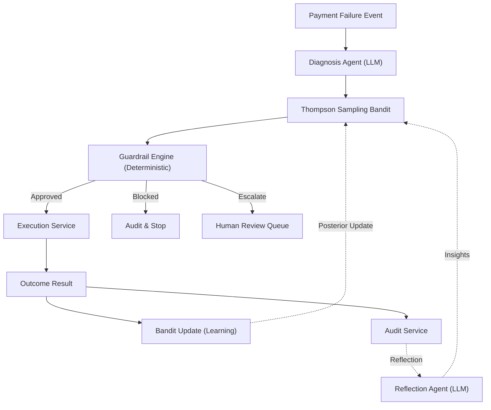
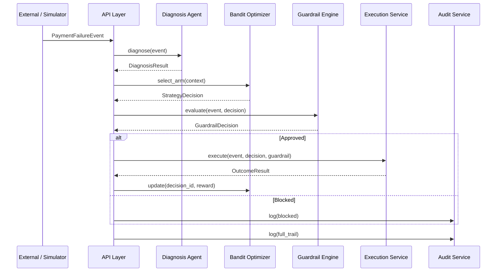

# RevPilot Architecture

## System Overview

RevPilot is an adaptive AI revenue recovery controller that automatically diagnoses failed payments, selects optimal retry strategies, and executes recovery actions within deterministic safety boundaries.

### Core Recovery Loop

## Architectural Principle

| Layer | Responsibility | Technology | May Authorize Payments? |
|-------|---------------|-----------|------------------------|
| **Interpretation** | Explain failures, enrich context, surface patterns | LLM (Gemini) | ❌ Never |
| **Optimization** | Select best retry strategy from learned distribution | Thompson Sampling | ❌ Never |
| **Authorization** | Approve, block, or escalate financial actions | Deterministic code | ✅ Only layer that can |

> **Invariant**: No LLM may directly authorize, modify, or execute a financial action. All financial authorization flows through the Guardrail Engine, which is 100% deterministic.

## Component Architecture

### API Layer (`backend/api/`)
- FastAPI REST endpoints
- Accepts `PaymentFailureEvent`, returns typed results
- Input validation via Pydantic
- Routes: `/events`, `/recover`, `/audit/{event_id}`, `/benchmark`, `/health`

### Diagnosis Agent (`backend/agents/diagnosis.py`)
- LLM-assisted root cause analysis
- Maps raw gateway error codes to `FailureReason` taxonomy
- Produces `DiagnosisResult` with retryability, confidence, and suggested strategies
- Falls back to taxonomy-based classification if LLM is unavailable

### Thompson Sampling Bandit (`backend/bandit/`)
- Multi-armed bandit with Beta-distributed arms
- One arm per `RetryStrategy` enum value
- Context-aware: conditions on failure reason, amount bucket, time of day
- Produces `StrategyDecision` with selected strategy and exploration flag
- State persisted to SQLite via `BanditState`

### Guardrail Engine (`backend/services/guardrail.py`)
- **The sole financial gatekeeper**
- Pure deterministic rules: max retries, velocity limits, cool-off periods, idempotency
- Every rule is a pure function: `(event, decision) → GuardrailDecision`
- Cannot be overridden by any LLM or statistical component

### Execution Service (`backend/services/execution.py`)
- Executes recovery action ONLY after guardrail approval
- Produces `OutcomeResult` with success/failure and timing
- In simulation mode, delegates to `OutcomeEngine`

### Audit Service (`backend/services/audit.py`)
- Immutable, append-only log
- Records every action with full context for reproducibility
- Produces `AuditEvent` entries linked by `event_id`

### Simulator (`backend/simulator/`)
- `EventGenerator`: Produces synthetic `PaymentFailureEvent` streams
- `GroundTruth`: Defines true recovery probabilities per (failure, strategy) pair
- `OutcomeEngine`: Simulates outcomes using ground truth
- `BaselineStrategy`: Implements naive baselines for benchmarking

### Reflection Agent (`backend/agents/reflection.py`)
- Reviews batches of outcomes offline
- Identifies patterns, anomalies, strategy drift
- Feeds qualitative insights back for human review

## Data Flow

## Technology Stack

| Component | Choice | Rationale |
|-----------|--------|-----------|
| Language | Python 3.12+ | Team familiarity, ecosystem, async support |
| API | FastAPI | Automatic OpenAPI docs, async, Pydantic integration |
| Contracts | Pydantic v2 | Runtime validation, serialization, IDE support |
| Database | SQLite | Zero-config for MVP, easy to upgrade to PostgreSQL |
| Testing | pytest | Fixtures, markers, async support |
| Linting | ruff + mypy | Fast linting + type checking |
| LLM | Gemini 2.5 Flash | Fast inference, good at classification tasks |
| Optimization | Thompson Sampling | Simple, well-understood, good exploration-exploitation |

## Deployment (MVP)

- Single process: `uvicorn backend.main:app`
- SQLite database in local filesystem
- No external dependencies beyond LLM API
- Benchmarks run in-process via simulator
