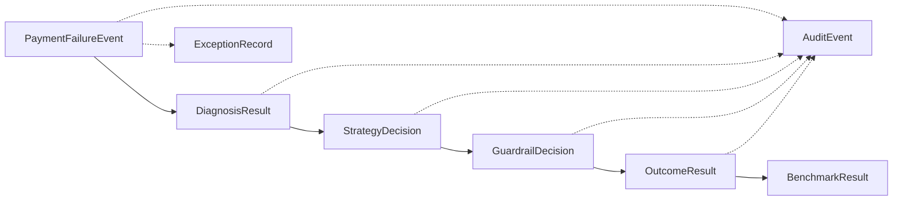

# Data Contracts

All component boundaries in RevPilot are defined by typed Pydantic schemas. This document specifies every contract, its producer/consumer, validation rules, and example payloads.

## Contract Map



| Contract | Producer | Consumer | Link |
|----------|----------|----------|------|
| `PaymentFailureEvent` | External system / Simulator | Diagnosis Agent | Input |
| `DiagnosisResult` | Diagnosis Agent | Bandit Optimizer | Diagnosis → Strategy |
| `StrategyDecision` | Bandit Optimizer | Guardrail Engine | Strategy → Safety |
| `GuardrailDecision` | Guardrail Engine | Execution Service | Safety → Execution |
| `OutcomeResult` | Execution Service / Simulator | Bandit (learning), Audit | Result |
| `AuditEvent` | All components | Audit Service | Logging |
| `BenchmarkResult` | Simulator | Reporting | Metrics |
| `ExceptionRecord` | All components | Exception Handler | Error tracking |

## Schemas

### PaymentFailureEvent

| Field | Type | Required | Constraints | Description |
|-------|------|----------|-------------|-------------|
| `event_id` | `str` | Auto | UUID v4 | Unique event identifier |
| `payment_id` | `str` | ✅ | — | Razorpay payment ID |
| `merchant_id` | `str` | ✅ | — | Merchant identifier |
| `amount` | `float` | ✅ | `> 0` | Transaction amount |
| `currency` | `str` | Default `INR` | — | ISO 4217 code |
| `payment_method` | `PaymentMethod` | ✅ | Enum | Payment instrument |
| `failure_reason` | `FailureReason` | ✅ | Enum | Classified failure |
| `failure_code` | `str` | ✅ | — | Raw gateway error |
| `card_last4` | `str?` | ❌ | — | Last 4 digits |
| `card_network` | `str?` | ❌ | — | visa, mastercard, etc. |
| `bank_code` | `str?` | ❌ | — | Issuing bank code |
| `attempt_number` | `int` | ✅ | `>= 1` | Attempt ordinal |
| `timestamp` | `datetime` | Auto | — | Failure time |
| `metadata` | `dict` | Default `{}` | — | Arbitrary context |

```json
{
  "event_id": "a1b2c3d4-e5f6-7890-abcd-ef1234567890",
  "payment_id": "pay_RAZORPAY123",
  "merchant_id": "merch_ACME",
  "amount": 2499.00,
  "currency": "INR",
  "payment_method": "credit_card",
  "failure_reason": "insufficient_funds",
  "failure_code": "INSUFFICIENT_FUNDS",
  "card_last4": "4242",
  "card_network": "visa",
  "bank_code": "HDFC",
  "attempt_number": 1,
  "timestamp": "2026-08-21T00:00:00Z",
  "metadata": {"channel": "web", "device": "mobile"}
}
```

### DiagnosisResult

| Field | Type | Required | Constraints | Description |
|-------|------|----------|-------------|-------------|
| `diagnosis_id` | `str` | Auto | UUID | Unique diagnosis ID |
| `event_id` | `str` | ✅ | — | Reference to event |
| `failure_category` | `FailureReason` | ✅ | Enum | Classified category |
| `is_retryable` | `bool` | ✅ | — | Worth retrying? |
| `confidence` | `float` | ✅ | `[0, 1]` | Diagnosis confidence |
| `reasoning` | `str` | ✅ | — | Human explanation |
| `suggested_strategies` | `list[RetryStrategy]` | ✅ | — | Ordered recommendations |
| `context_signals` | `dict` | Default `{}` | — | Contextual features |
| `diagnosed_at` | `datetime` | Auto | — | Diagnosis timestamp |

```json
{
  "diagnosis_id": "diag_001",
  "event_id": "a1b2c3d4-e5f6-7890-abcd-ef1234567890",
  "failure_category": "insufficient_funds",
  "is_retryable": true,
  "confidence": 0.85,
  "reasoning": "Insufficient funds. Salary credit expected by evening.",
  "suggested_strategies": ["delayed_retry", "amount_split", "time_shift"],
  "context_signals": {"time_of_day": "morning", "day_of_month": 21},
  "diagnosed_at": "2026-08-21T00:01:00Z"
}
```

### StrategyDecision

| Field | Type | Required | Constraints | Description |
|-------|------|----------|-------------|-------------|
| `decision_id` | `str` | Auto | UUID | Unique decision ID |
| `event_id` | `str` | ✅ | — | Reference to event |
| `diagnosis_id` | `str` | ✅ | — | Reference to diagnosis |
| `selected_strategy` | `RetryStrategy` | ✅ | Enum | Chosen strategy |
| `confidence` | `float` | ✅ | `[0, 1]` | Bandit confidence |
| `exploration` | `bool` | ✅ | — | Explore vs exploit |
| `arm_probabilities` | `dict[str, float]` | ✅ | — | All arm samples |
| `context_used` | `dict` | Default `{}` | — | Features used |
| `decided_at` | `datetime` | Auto | — | Decision timestamp |

### GuardrailDecision

| Field | Type | Required | Constraints | Description |
|-------|------|----------|-------------|-------------|
| `guardrail_id` | `str` | Auto | UUID | Unique evaluation ID |
| `decision_id` | `str` | ✅ | — | Reference to strategy |
| `event_id` | `str` | ✅ | — | Reference to event |
| `verdict` | `GuardrailVerdict` | ✅ | Enum | approved/blocked/escalate |
| `rules_evaluated` | `list[str]` | ✅ | — | All rules checked |
| `rules_triggered` | `list[str]` | Default `[]` | — | Rules that fired |
| `reason` | `str` | ✅ | — | Human explanation |
| `retry_count_24h` | `int` | ✅ | — | Retries in last 24h |
| `max_retry_limit` | `int` | ✅ | — | Config limit |
| `evaluated_at` | `datetime` | Auto | — | Evaluation timestamp |

### OutcomeResult

| Field | Type | Required | Constraints | Description |
|-------|------|----------|-------------|-------------|
| `outcome_id` | `str` | Auto | UUID | Unique outcome ID |
| `event_id` | `str` | ✅ | — | Reference to event |
| `decision_id` | `str` | ✅ | — | Reference to strategy |
| `strategy_applied` | `RetryStrategy` | ✅ | Enum | Strategy executed |
| `status` | `OutcomeStatus` | ✅ | Enum | success/failure/pending/abandoned |
| `amount_recovered` | `float` | Default `0` | `>= 0` | Amount recovered |
| `latency_ms` | `int` | Default `0` | `>= 0` | Latency in ms |
| `gateway_response_code` | `str?` | ❌ | — | Gateway response |
| `completed_at` | `datetime` | Auto | — | Completion time |

### AuditEvent

| Field | Type | Required | Constraints | Description |
|-------|------|----------|-------------|-------------|
| `audit_id` | `str` | Auto | UUID | Unique audit ID |
| `event_id` | `str` | ✅ | — | Reference to event |
| `action` | `AuditAction` | ✅ | Enum | What happened |
| `actor` | `str` | ✅ | — | Component name |
| `details` | `dict` | Default `{}` | — | Action details |
| `idempotency_key` | `str` | ✅ | — | Dedup key |
| `parent_audit_id` | `str?` | ❌ | — | Chain link |
| `created_at` | `datetime` | Auto | — | Creation time |

### BenchmarkResult

| Field | Type | Required | Constraints | Description |
|-------|------|----------|-------------|-------------|
| `benchmark_id` | `str` | Auto | UUID | Unique run ID |
| `strategy_name` | `str` | ✅ | — | Strategy name |
| `total_events` | `int` | ✅ | `>= 0` | Event count |
| `recovery_rate` | `float` | ✅ | `[0, 1]` | Recovery fraction |
| `revenue_recovered` | `float` | ✅ | `>= 0` | Total revenue |
| `avg_time_to_recovery_ms` | `float` | ✅ | `>= 0` | Avg latency |
| `false_positive_rate` | `float` | ✅ | `[0, 1]` | Unnecessary retries |
| `guardrail_block_rate` | `float` | ✅ | `[0, 1]` | Block fraction |
| `baseline_recovery_rate` | `float` | ✅ | `[0, 1]` | Baseline rate |
| `improvement_over_baseline` | `float` | ✅ | — | % improvement |
| `run_at` | `datetime` | Auto | — | Run timestamp |
| `parameters` | `dict` | Default `{}` | — | Config used |

### ExceptionRecord

| Field | Type | Required | Constraints | Description |
|-------|------|----------|-------------|-------------|
| `exception_id` | `str` | Auto | UUID | Unique record ID |
| `event_id` | `str?` | ❌ | — | Related event |
| `component` | `str` | ✅ | — | Component name |
| `exception_type` | `str` | ✅ | — | Exception class |
| `message` | `str` | ✅ | — | Error message |
| `stack_trace` | `str?` | ❌ | — | Full trace |
| `severity` | `str` | Default `error` | — | error/warning/critical |
| `handled` | `bool` | Default `true` | — | Handled gracefully? |
| `fallback_action` | `str?` | ❌ | — | What fallback ran |
| `occurred_at` | `datetime` | Auto | — | When it happened |

## Versioning Strategy

- Contracts are versioned via the API path (`/api/v1/`)
- Breaking schema changes require a new API version
- Additive changes (new optional fields) are backward-compatible
