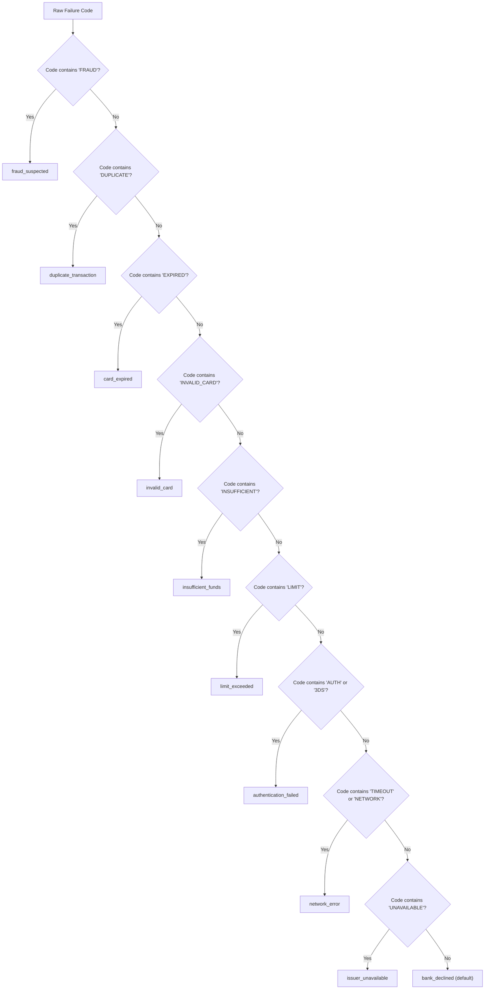

# Failure Taxonomy

Structured classification of payment failure reasons for the Indian payments ecosystem.

## Categories

| Failure Reason | Retryable | Base Recovery Rate | Default Strategies |
|---------------|-----------|-------------------|-------------------|
| `insufficient_funds` | ✅ | 35% | delayed_retry, amount_split, time_shift |
| `card_expired` | ❌ | 5% | card_switch |
| `bank_declined` | ✅ | 25% | delayed_retry, time_shift |
| `network_error` | ✅ | 75% | immediate_retry |
| `fraud_suspected` | ❌ | 0% | no_action |
| `authentication_failed` | ✅ | 40% | immediate_retry, delayed_retry |
| `limit_exceeded` | ✅ | 30% | delayed_retry, amount_split, time_shift |
| `invalid_card` | ❌ | 2% | card_switch |
| `issuer_unavailable` | ✅ | 60% | delayed_retry, time_shift |
| `duplicate_transaction` | ❌ | 0% | no_action |

## Detailed Descriptions

### insufficient_funds
- **Description**: Cardholder's account has insufficient balance for the transaction.
- **Retryable**: Yes — balance may be replenished (salary credits, transfers).
- **Strategies**: `delayed_retry` (wait for balance), `amount_split` (smaller amounts), `time_shift` (retry at salary day).
- **Recovery Rate**: ~35%. Highly time-dependent — recovery rate increases near salary dates (1st, 15th of month).
- **Razorpay Codes**: `BAD_REQUEST_ERROR:INSUFFICIENT_FUNDS`, `GATEWAY_ERROR:INSUFFICIENT_FUNDS`

### card_expired
- **Description**: Card has passed its expiration date and is no longer valid.
- **Retryable**: No — the same card will always fail.
- **Strategies**: `card_switch` (prompt user to use a different card).
- **Recovery Rate**: ~5%. Only recoverable if user has a saved alternate card.
- **Razorpay Codes**: `BAD_REQUEST_ERROR:CARD_EXPIRED`

### bank_declined
- **Description**: Issuing bank declined the transaction without a specific reason code.
- **Retryable**: Yes — generic declines are often transient.
- **Strategies**: `delayed_retry` (wait and retry), `time_shift` (try during business hours).
- **Recovery Rate**: ~25%. Varies significantly by bank and time.
- **Razorpay Codes**: `GATEWAY_ERROR:BANK_DECLINED`, `BAD_REQUEST_ERROR:DECLINED`

### network_error
- **Description**: Transaction failed due to network timeout or connectivity issue between gateway and bank.
- **Retryable**: Yes — the underlying issue is transient.
- **Strategies**: `immediate_retry` (retry right away).
- **Recovery Rate**: ~75%. Highest recovery category — most resolve on immediate retry.
- **Razorpay Codes**: `GATEWAY_ERROR:NETWORK_ERROR`, `GATEWAY_ERROR:TIMEOUT`

### fraud_suspected
- **Description**: Transaction flagged for suspected fraud by the issuer or gateway risk engine.
- **Retryable**: No — retrying a fraud-flagged transaction is unsafe and may trigger further blocks.
- **Strategies**: `no_action`. Log and do not retry.
- **Recovery Rate**: 0%. Must not be retried.
- **Razorpay Codes**: `BAD_REQUEST_ERROR:FRAUD_RISK`, `GATEWAY_ERROR:FRAUD_SUSPECTED`

### authentication_failed
- **Description**: 3DS / OTP authentication failed or was abandoned by the cardholder.
- **Retryable**: Yes — cardholder may complete authentication on retry.
- **Strategies**: `immediate_retry` (give another chance), `delayed_retry` (try later when user is more attentive).
- **Recovery Rate**: ~40%. Depends heavily on user engagement.
- **Razorpay Codes**: `BAD_REQUEST_ERROR:AUTHENTICATION_FAILED`, `BAD_REQUEST_ERROR:3DS_FAILED`

### limit_exceeded
- **Description**: Transaction exceeds the cardholder's daily or monthly spending limit.
- **Retryable**: Yes — limits reset on the next cycle.
- **Strategies**: `delayed_retry` (wait for limit reset), `amount_split` (try smaller amount), `time_shift` (next billing cycle).
- **Recovery Rate**: ~30%.
- **Razorpay Codes**: `BAD_REQUEST_ERROR:LIMIT_EXCEEDED`, `GATEWAY_ERROR:DAILY_LIMIT`

### invalid_card
- **Description**: Card number is invalid, cancelled, or does not exist in the issuer's system.
- **Retryable**: No — same card will always fail.
- **Strategies**: `card_switch` (use a different card).
- **Recovery Rate**: ~2%. Almost never recoverable with the same card.
- **Razorpay Codes**: `BAD_REQUEST_ERROR:INVALID_CARD`, `BAD_REQUEST_ERROR:CARD_NOT_FOUND`

### issuer_unavailable
- **Description**: Issuing bank's systems are temporarily down or unreachable.
- **Retryable**: Yes — bank outages are typically short-lived.
- **Strategies**: `delayed_retry` (wait for bank to recover), `time_shift` (retry later).
- **Recovery Rate**: ~60%. Banks usually recover within minutes to hours.
- **Razorpay Codes**: `GATEWAY_ERROR:ISSUER_UNAVAILABLE`, `GATEWAY_ERROR:BANK_UNAVAILABLE`

### duplicate_transaction
- **Description**: A duplicate of this transaction has already been processed.
- **Retryable**: No — retrying would create another duplicate.
- **Strategies**: `no_action`. Verify original transaction status.
- **Recovery Rate**: 0%. Must not be retried.
- **Razorpay Codes**: `BAD_REQUEST_ERROR:DUPLICATE_REQUEST`

## Classification Decision Tree

