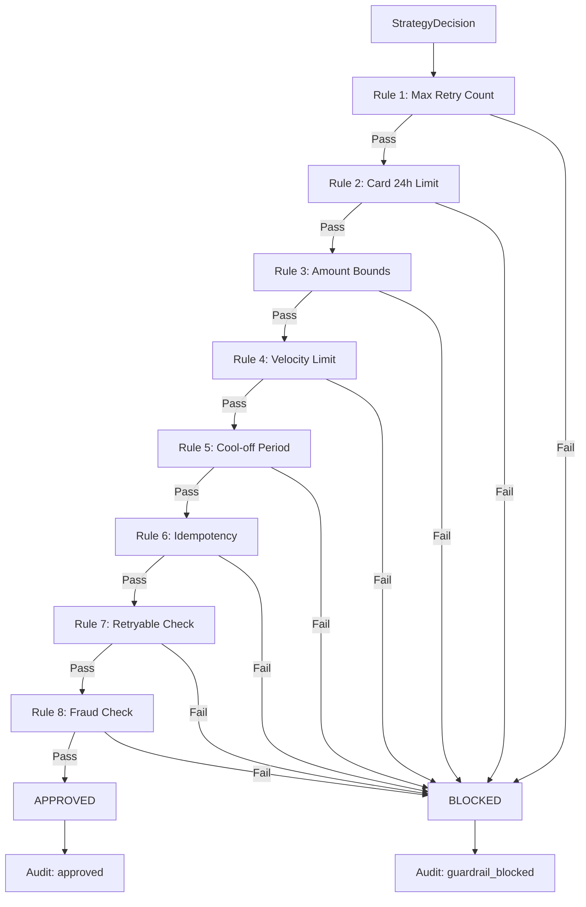

# Guardrail Design

## Principle

> Deterministic guardrails are **non-negotiable**. No LLM, no statistical model, and no probabilistic component may bypass or override the guardrail engine.

The guardrail engine is the **sole financial gatekeeper** in RevPilot. Every retry decision must pass through it before execution. It is implemented as a pipeline of pure, deterministic functions.

## Rules

| # | Rule | Parameter | Default | Action on Violation |
|---|------|-----------|---------|-------------------|
| 1 | Max retry count per payment | `max_retries_per_payment` | 3 | Block |
| 2 | Max retry count per card per 24h | `max_retries_per_card_24h` | 5 | Block |
| 3 | Amount mutation bounds | ±0% (MVP) | 0% | Block |
| 4 | Velocity limit | Max 10 retries per merchant per minute | 10/min | Block |
| 5 | Cool-off period | Min seconds between retries | 300s | Block |
| 6 | Idempotency enforcement | Dedup on (payment_id, strategy, attempt) | — | Block |
| 7 | Non-retryable failure check | Based on taxonomy | — | Block |
| 8 | Fraud flag check | If fraud_suspected | — | Block |

## Rule Evaluation Pipeline



Each rule is a pure function with the signature:

```python
def check_rule(event: PaymentFailureEvent, decision: StrategyDecision, context: dict) -> tuple[bool, str]:
    """Returns (passed: bool, reason: str)."""
```

All rules are always evaluated (even after a block) so the `GuardrailDecision` contains the full list of triggered rules for debugging.

## Rule Details

### Rule 1: Max Retry Count Per Payment
- Count total retries for `payment_id`
- Block if `attempt_number > max_retries_per_payment`
- Rationale: Prevents infinite retry loops

### Rule 2: Max Retries Per Card Per 24h
- Count retries for `card_last4` (or payment instrument) in rolling 24h window
- Block if count exceeds `max_retries_per_card_24h`
- Rationale: Prevents card abuse / triggering bank fraud alerts

### Rule 3: Amount Mutation Bounds
- In MVP, **no amount changes are allowed** — the retry must use the exact original amount
- Future: allow ±X% for amount_split strategy
- Rationale: Prevents unauthorized amount modifications

### Rule 4: Velocity Limit
- Count retries for `merchant_id` in the last 60 seconds
- Block if exceeding 10 per minute
- Rationale: Prevents retry storms that could overload the gateway

### Rule 5: Cool-off Period
- Minimum `guardrail_cooloff_seconds` between retries for the same payment
- Block if last retry was too recent
- Rationale: Gives transient issues time to resolve

### Rule 6: Idempotency Enforcement
- Hash of `(payment_id, strategy, attempt_number)` must be unique
- Block if duplicate detected
- Rationale: Prevents double-charging

### Rule 7: Non-retryable Failure Check
- Look up `failure_reason` in taxonomy
- Block if `retryable == False`
- Rationale: Never retry fraud, expired cards, duplicates

### Rule 8: Fraud Flag Check
- If `failure_reason == fraud_suspected`, block unconditionally
- Rationale: Zero tolerance for fraud flags

## Safe Defaults

If any guardrail component fails (exception, timeout, data corruption):
- **Default verdict: BLOCKED**
- Log an `ExceptionRecord` with `severity=critical`
- Never default to approved

## Escalation Policy

- If verdict is `escalate`, the retry is NOT executed
- The event is flagged for human review
- Currently: escalation is logged but not routed (no notification system in MVP)

## Interaction with Bandit

The bandit may select any strategy, including non-retryable ones. The guardrail engine is the safety net:

```
Bandit says: "Try immediate_retry for fraud_suspected"
Guardrail says: "BLOCKED — Rule 7: fraud_suspected is non-retryable"
```

This separation ensures the bandit can explore freely without financial risk.
